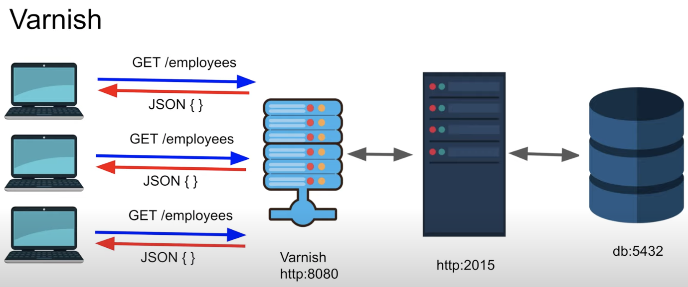
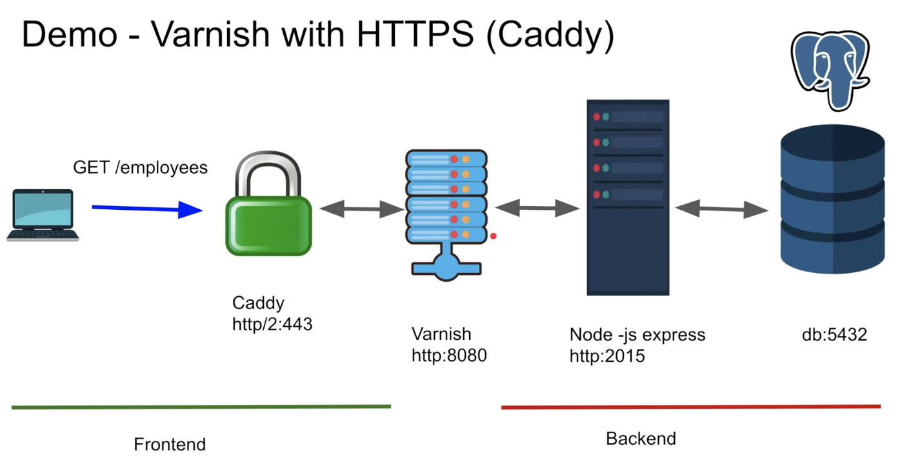

# Présentation Varnish

Varnish est un reverse proxy accelérateur HTTP/HTTPS écrit en C.

Réf : 
[Varnish-HTTP Accelerator Crash 
Course](https://www.youtube.com/watch?v=-cWs6eoyaLg&list=TLPQMjcwMzIwMjN7Q6E2vZO6Qg&index=2)

Un reverse proxy fait la requête pour nous auprès du 
serveur. C'est un intermédiaire, comme l'illustre le schéma 
ci-dessous :  



# Utilisation en HTTP

Pour une utilisation rapide et facile de Varnish il va nous 
falloir un serveur typiquement en *node-js* qui tourne avec 
une base de données et *docker* avec un conteneur que l'on va 
dedié à 
Varnish.
Apparemment, *docker* peut gérer la base de données.

Une fois le serveur setup il nous faut créer un fichier `vcl` 
(Varnish Configuration Language) proche du format JSON que 
l'on peut initialiser comme suit : 

```JSON
#default.vcl
vcl 4.0 ;

backend default {
  .host = "my_localhost";
  .port = "2015";
}
```

Il nous suffit après de copier ce fichier dans notre conteneur 
docker avec la commande `docker cp default.vcl 
my_container:/etc/varnish` ; puis `docker start my_container`.

Maintenant, en nous connectant sur le port 8080 au lieu de 
2015 on se connecte à `varnish`. Le conteneur `varnish` va 
maintenant exécuter les commandes auprès de la base de données 
et du site pour nous ainsi que mettre en cache les data 
demandées. 
Le gain de temps est considérable puisque la requête est 
quasiment instantanée.


# Ajout de la sécurité via HTTPS

Dans la présentation de Varnish il est utilisé l'outil *caddy* 
qui agit également comme un reverse proxy assurant quant-à-lui 
la sécurité HTTPS de la connexion. Voici un schéma présentant 
al configuration : 
 

