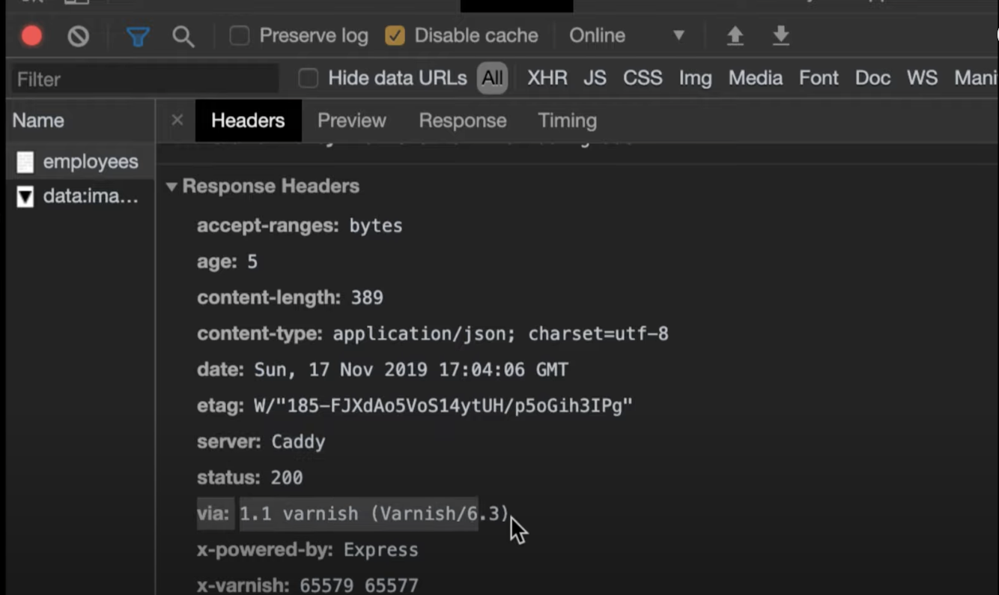
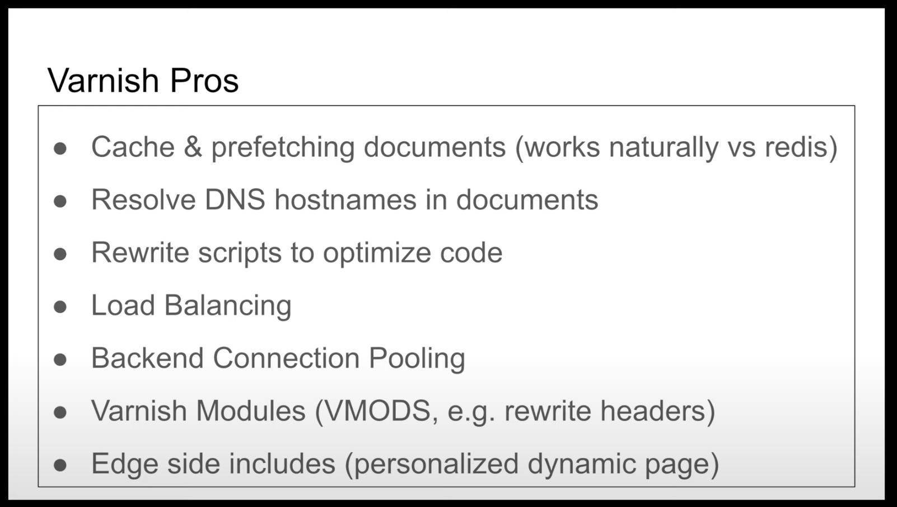
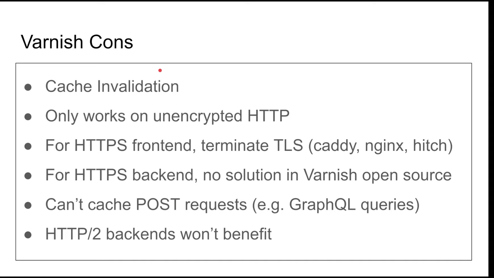

# Présentation Varnish

Varnish est un reverse proxy accelérateur HTTP/HTTPS écrit en C.

Réf : 
[Varnish-HTTP Accelerator Crash 
Course](https://www.youtube.com/watch?v=-cWs6eoyaLg&list=TLPQMjcwMzIwMjN7Q6E2vZO6Qg&index=2)

Un reverse proxy fait la requête pour nous auprès du 
serveur. C'est un intermédiaire, comme l'illustre le schéma 
ci-dessous :  


# Utilisation en HTTP

Pour une utilisation rapide et facile de Varnish il va nous 
falloir un serveur typiquement en *node-js* qui tourne avec 
une base de données et *docker* avec un conteneur que l'on va 
dedié à 
Varnish.
Apparemment, *docker* peut gérer la base de données.

Une fois le serveur setup il nous faut créer un fichier `vcl` 
(Varnish Configuration Language) proche du format JSON que 
l'on peut initialiser comme suit : 

```
#default.vcl
vcl 4.0 ;

backend default {
  .host = "my_localhost";
  .port = "2015";
}
```

Il nous suffit après de copier ce fichier dans notre conteneur 
docker avec la commande `docker cp default.vcl 
my_container:/etc/varnish` ; puis `docker start my_container`.

Maintenant, en nous connectant sur le port 8080 au lieu de 
2015 on se connecte à `varnish`. Le conteneur `varnish` va 
maintenant exécuter les commandes auprès de la base de données 
et du site pour nous ainsi que mettre en cache les data 
demandées. 
Le gain de temps est considérable puisque la requête est 
quasiment instantanée.


# Ajout de la sécurité via HTTPS

Dans la présentation de Varnish il est utilisé l'outil *caddy* 
qui agit également comme un reverse proxy assurant quant-à-lui 
la sécurité HTTPS de la connexion. Voici un schéma présentant 
al configuration : 
 


## Configuration de caddy

Déjà on a besoin de notre adresse ddns (de la forme 
`myhost.ddns.net`).
L'installation et la configuration de caddy est traité dasn 
cette vidéo : 
[Begin with Caddy, webserver HTTPS from scratch](https://www.youtube.com/watch?v=t4naLFSlBpQ)

## Connecter Caddy avec notre setup

Commencer par créer un dossier qui contiendra toutes les 
informations a propos de Caddy : `mkdir caddy && cd caddy`.

Puis créer un fichier `Caddyfile` : 
```
myhost.ddns.net {
  proxy / 127.0.0.1 8080 
}
```

Maintenant on peut lancer la commande `caddy` qui sera 
configurée automatiquement via `Caddyfile`.


## Lancement

Maintenant en tapant notre adresse : `https://myhost.ddns.net` 
on accède aux mêmes site que précédemment mais via une 
connexion HTTPS sécurisée.



On notera dans cette image que la connexion se fait via 
Varnish qui passe ainsi les requêtes à notre place auprès du 
serveur puis de la db. C'est pourquoi il faut bien connecter 
Caddy à Varnish (donc à son port `8080` et non directement à 
notre serveur HTTP). Le server devient également Caddy et non 
pas notre localhost (ou l'IP du serveur sur lequel on déploie 
notre application/site web).


# Retour sur Varnish

Quelques pour et contre : 





Il y a donc un manque de réactivité par rapport aux actions de 
l'utilisateur et cela peut être une carance importante sur la 
dynamique avec l'utilisateur d'utiliser Varnish.
Néanmoins, on voit pour le cas des connexion HTTP non encrypté 
qu'il existe des outils permettant de palier ce manque. On 
peut alors supposer qu'il existe des moyens de contourner les 
limitations de POST requests et d'intéractions 
utilisateurs-serveur.

# Conclusion

Varnish est un outil en ligne de commande qui se place entre 
l'utilisateur et le serveur. Cela peut être très intéressant 
car on peut alors personnaliser l'interaction user-server via 
Varnish. 
Un autre bon point est que l'on peut apparemment facilement 
utiliser docker et le faire tourner via un conteneur. 
De plus, la communauté de Varnish à l'air assez développée et 
doit nous permettre d'avoir un accompagnement assez précis 
tout au long de notre implémentation. 

Les limitations vis à vis des requêtes HTTPS, POST et plus 
générallement les interactions user-server doivent pouvoir 
être palier par des outils intermédiaires qu'il nous faut 
néanmoins chercher pour certains.

L'utilisation de Varnish peut être un pari avec un risque de 
fail mais son apparente simplicité d'utilisation semble 
néanmoins nous permettre de quoiqu'il arrive pouvoir présenter 
un MVP (Minimum Viable Product) assez aisément pour le 7 mai.
De plus, le côté business de Varnish avec logiciel pro et 
beaucoup d'optimisation supplémentaire avec service technique 
peut nous permettre de montrer que l'on propose une première 
visualisation via du code Open-Source mais que tout ça peut 
passer très rapidement en production moyennant un paiement pour 
certains accès business. 
Cela peut nous permettre de passer pour de réels professionels, 
testant d'abord les fonctionnalités Open-Source avant de 
proposer au patron de passer sur Varnish Business. 

Je noterai également les mails reçus le lendemain du 
téléchargement du livre avec une réponse très rapide suite à 
une question d'implémentation avec de nombreux liens 
communautaires. Cela participe à renforcer l'esprit très 
professionel de Varnish et à nous placer comme réels employés 
au service de l'efficacité. 

Je terminerai en mettant des liens que j'ai récolté ici et là à 
propos de la communauté, du code et des tutos. 
Si l'on choisit Varnish cela nous permettra de rentrer assez 
rapidement dans cette tech sans perdre trop longtemps à 
chercher des sources basiques. 


# Références et liens utiles


## Code 
[Varnish cache Github](https://github.com/varnishcache/varnish-cache)

## Varnish Doc
[Introduction to Varnish](https://varnish-cache.org/intro/index.html#intro)

[The Varnish Tutorial — Varnish version 7.3.0 documentation](https://varnish-cache.org/docs/trunk/tutorial/)

[Varnish HTTP Cache — Varnish HTTP Cache](https://varnish-cache.org/)

## Community and Help
[Getting Help — Varnish HTTP Cache](https://varnish-cache.org/support/index.html)

[Discord Varnish Cache](https://discord.com/invite/EuwdvbZR6d)

## Business
[Varnish HTTP Cache Business](https://varnish-cache.org/business/index.html)

[Pricing | Varnish Software](https://www.varnish-software.com/pricing/)

[API and Web Acceleration | Varnish Software](https://www.varnish-software.com/solutions/http-api-acceleration/)


